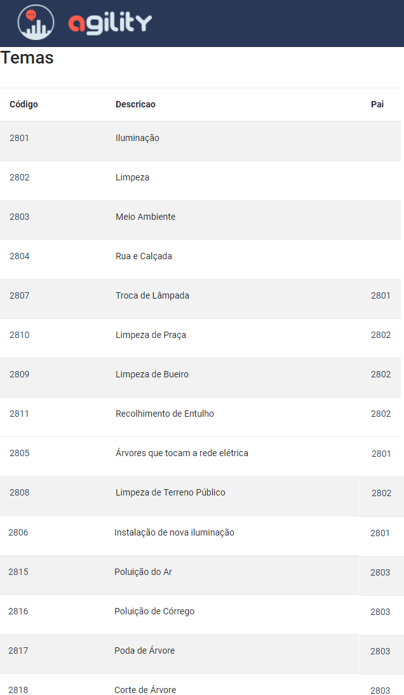
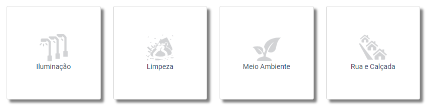

Manual do Usuário do Agility 
============================ 

Tudo o que você precisa saber sobre o Agility

Temas e Serviços
================

     

   
Triagem Automática
================== 

Dependendo da configuração da triagem automática, um chamado pode ser classificado em três categorias distintas: 

* Aprovado Automaticamente
* Em Verificação
* Reprovado Automaticamente

.. toctree::
   :maxdepth: 5
   
   Geral 
   Palavras
   Imagem
   Endereço
   Prioridade   
   

Cadastros
=========

* :ref:`genindex`
* :ref:`modindex`
* :ref:`search`
