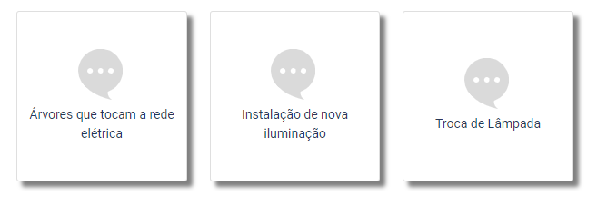
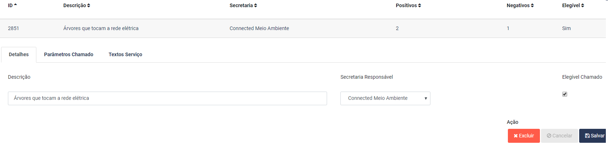
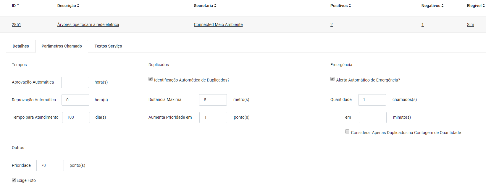
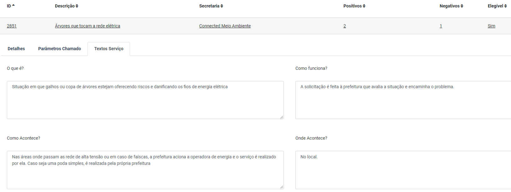
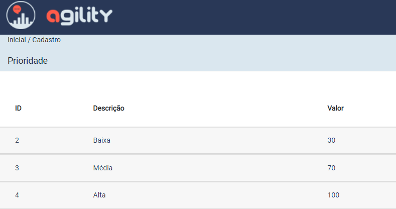
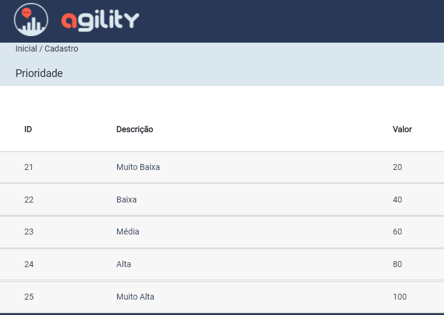
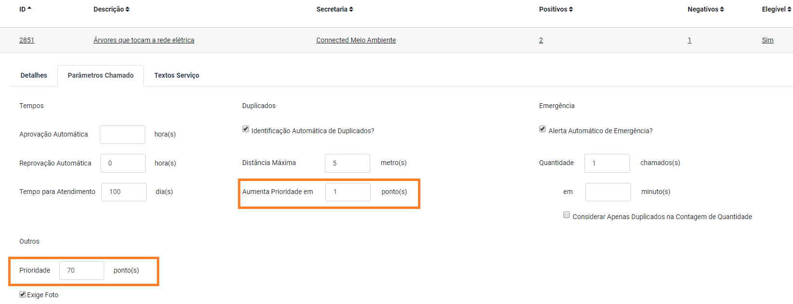
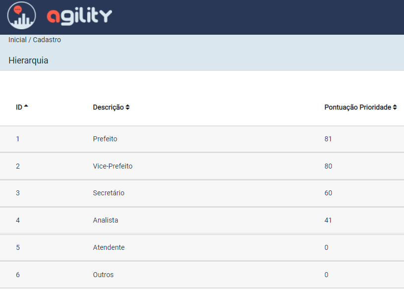

.. This is a comment. Note how any initial comments are moved by
   transforms to after the document title, subtitle, and docinfo.

.. agility.rst from: https://github.com/deborabeatriz/AgilityManual/   

.. |EXAMPLE| image:: static/yi_jing_01_chien.jpg
   :width: 1em

******* 
Agility
******* 

.. contents:: Conteúdo

Introdução
==========

Aqui você vai encontrar tudo que precisa saber sobre o Agility.

       
Cadastros
=========

Através dos cadastros é possível personalizar o Agility para a prefeitura ou empresa.

Usuários
-------- 

Os diversos tipos de usuário podem ser criados com os perfis necessários de acesso. São eles: solicitante, operador ou gestor e atendente.

Solicitante
^^^^^^^^^^^

Um usuário comum do Agility seria um cidadão, no caso de governo, ou um cliente, no caso de empresa privada.

Operador
^^^^^^^^

Funcionário da empresa ou governo

Gestor
^^^^^^

Executa análises gerenciais no sistema Agility

Atendente
^^^^^^^^^^

Efetua abertura de chamados no nome de outros solicitantes.

Temas e Serviços
----------------

Em cada instalação do Agility é possível configurar vários níveis de temas, com ícones próprios associados, atribuindo serviços ao último nível. Os serviços podem dar origem a abertura de chamados, ou podem ser informativos.

Temas
^^^^^^

A figura a seguir demonstra uma lista de temas configurados, sendo que o nível indicado em pai é o nível anterior a ser navegado até que se chegue ao nível atual.

.. figure:: tema_conf.png
   :scale: 35 %
   :alt: tela de configuração de temas

A figura a seguir ilustra como são exibidos no menu de solicitação de serviços os primeiros temas do nível, ou seja, que não têm um código de pai associado.

.. figure:: tema.png
   :scale: 35 %
   :alt: resultado da configuração primeiro nível

A seguir estão ilustrados os temas associados ao nível 'Iluminação'.  

Serviços
^^^^^^^^

Os temas do último nível da navegação devem ser associados cada obrigatoriamente a um serviço. Por sua vez, o serviço pode ou não dar origem a um chamado, dependendo das informações indicadas em seu cadastro. 

A figura a seguir mostra a primeira aba do cadastro de um serviço. 
Quando o serviço é meramente informativo, a opção do cadastro 'Elegível Chamado' fica desabilitada, sendo que o serviço exibe apenas textos informativos indicados na aba "Textos Serviços". 
Já um serviço que pode dar origem a um chamado, tem a opção do cadastro 'Elegível Chamado' habilitada. Além disso, serviços que podem dar origem a chamados possuem parâmetros configuráveis informados na aba "Parâmetros Chamado".

   

 

Triagem Automática
------------------

Dependendo da configuração da triagem automática, um novo chamado pode ser classificado em três categorias distintas: 

* Aprovado Automaticamente: a classificação de aprovado pode ser trocada pelo operador durante o tempo indicado na aba parâmetros do chamado do cadastro de serviço. Passado esse tempo, as tarefas do chamado ficam habilitadas para planejamento automático ou manual

* Em Verificação: a classificação em verificação precisa de ação manual do operador. Um chamado classificado assim tem que ser aprovado manualmente para que seu planejamento automático ou manual seja habilitado. Sua recusa retorna uma resposta ao solicitante do chamado de que ele não foi atendido.

* Reprovado Automaticamente: a classificação de reprovado pode ser trocada pelo operador durante o tempo indicado na aba parâmetros do chamado do cadastro de serviço. Passado esse tempo, o chamado é recusado, o usuário recebe mensagem automática com as razões da recusa e as tarefas do chamado não podem mais ser planejadas.

Texto
^^^^^

Há dois tipos de triagem distintas para texto:

  Palavras Ofensivas
     Com base em um cadastro de palavras ofensivas, fornecido pelo Agility e mantido pelo operador, o Agility verifica a cada novo chamado quantas palavras ofensivas existem em seu texto. Seguindo os números máximos de palavras ofensivas configurados na triagem, o chamado pode ser aprovado automaticamente, reprovado automaticamente ou colocado em verificação para essa triagem.   
  Palavras Relevantes
     Com base em um cadastro de palavras irrelevantes, fornecido pelo Agility e mantido pelo operador, o Agility calcula quantas palavras relevantes existem de fato no texto. Para isso desconta do texto as palavras ofensivas e as palavras irrelevantes cadastradas. Seguindo os números mínimos de palavras relevantes configurados na triagem, o chamado pode ser aprovado automaticamente, reprovado automaticamente ou colocado em verificação para essa triagem.   

Imagem
^^^^^^

Utilizando inteligência artificial, o Agility analisa e classifica automaticamente as imagens anexadas ao chamado. As classificações possíveis quanto à probabilidade de serem ofensivas ou trotes são:

* Muito pouco provável

* Pouco provável

* Possível

* Provavelmente

* Muito Provavelmente

Seguindo as categorias configuradas na triagem, o chamado pode ser aprovado automaticamente, reprovado automaticamente ou colocado em verificação para essa triagem.   

Endereço
^^^^^^^^

Utilizando Google Maps, o Agility analisa e classifica automaticamente os endereços informados no chamado. As categorizações possíveis quanto à precisão do endereço informado pelo solicitante são:

* GPS: obtido automaticamente através do GPS do celular

* Preciso: o endereço informado foi encontrado com precisão, ou seja, logradouro e número

* Entre dois pontos: foi encontrado um logradouro para o endereço informado, mas o local apontado encontra-se entre dois números de um logradouro

* Centro de rua ou polígono: foi encontrado um local para o endereço informado, mas encontra-se em um logradouro, sem ser possível determinar entre quais números está

* Aproximado: não foi possível encontrar um logradouro ou uma área específica para o local informado

* Manual: endereço digitado manualmente pelo solicitante, ou seja, não houve uso do Google Maps seja por algum erro interno em sua execução ou porque o dispositivo móvel não estava conectado a Internet no momento da abertura do chamado

Seguindo as categorias configuradas na triagem, o chamado pode ser aprovado automaticamente, reprovado automaticamente ou colocado em verificação para essa triagem.   

Prioridade
^^^^^^^^^^

O Agility tem faixas de prioridade configuráveis.  A seguir, as figuras mostram exemplos com duas configurações de faixas em instalações distintas do Agility. 
Na primeira, o operador optou por três faixas de prioridade, entregues pelo Agility como padrão, e na segunda, por cinco. 
As prioridades sempre começam em 0 e vão até o valor mais alto indicado pelo operador nas faixas. Nos exemplos, vão de 0 a 100. A informação 'valor' representa o valor mais alto da faixa.

   

   
A pontuação da prioridade é atribuída automaticamente assim que um chamado é recebido pelo sistema. As pontuações devem ser indicadas previamente nos cadastros do serviço e da hierarquia.

  Por serviço
     Cada serviço pode ter uma pontuação de prioridade padrão atribuída em seu cadastro. Assim que for recebido, o chamado recebe o valor indicado nessa configuração. Além disso, essa pontuação recebe adições de outras configurações de prioridade, citadas imediatamente a seguir.
  Por chamados vinculados, ou seja, identificados automaticamente ou manualmente como uma mesma solicitação de serviço
     Ainda no cadastro de serviço, uma pontuação de prioridade pode ser configurada para que seja somada a um chamado a cada novo vínculo identificado como seu vínculo, ou seja, a cada novo chamado duplicado associado a ele. 
	 

	 
	 
  Por hierarquia
	 As hierarquias dos operadores também oferecem a opção de indicar uma pontuação de prioridade a ser somada ao chamado. A pontuação dependendo da hierarquia do operador que abrir ou solicitar um chamado a um atendente.

