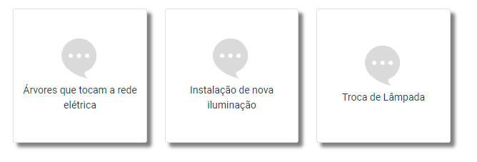

Temas
=====

Tudo o que você precisa saber sobre o Agility

A figura a seguir demonstra uma lista de temas configurados, sendo que os níveis são indicados na coluna pai. 
.. figure:: tema_conf.png
   :scale: 35 %
   :alt: configuração de temas

A figura a seguir ilustra com são exibidos no menu de solicitação de serviços os temas que não têm um código de pai associado. Eles aparecem no primeiro nível.
.. figure:: tema.png
   :scale: 35 %
   :alt: resultado da configuração para 'iluminação'

A seguir estão ilustrados os temas associados ao nível 'Iluminação'.  

   
Triagem Automática
================== 

Dependendo da configuração da triagem automática, um chamado pode ser classificado em três categorias distintas: 

* Aprovado Automaticamente
* Em Verificação
* Reprovado Automaticamente

.. toctree::
   :maxdepth: 6
   
   Geral 
   Palavras
   Imagem
   Endereço
   Prioridade   
   
  

Cadastros
=========

* :ref:`genindex`
* :ref:`modindex`
* :ref:`search`
